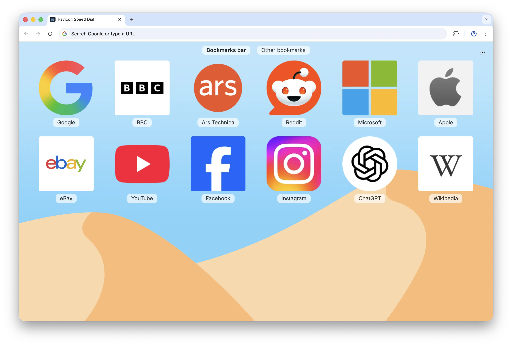

<div style="text-align:center"></div>

# Favicon Speed Dial

Favicon Speed Dial is a browser extension that replaces the new tab page with a colourful grid of your bookmarks and folders, with large favicons and custom wallpapers.

## Acknowledgements

This project is a **fork** of **[Easy Speed Dial](https://github.com/lucaseverett/easy-speed-dial)** by **[Lucas Everett](https://lucaseverett.dev/)**. Favicon Speed Dial is built on top of that work and would not exist without the original app and its MIT licence. Thank you, Lucas, for publishing such a solid foundation.

## Licence and fork notes

This project is released under the **[MIT License](LICENSE)** (see that file for the full text).

Because the upstream project is also MIT-licensed, you may fork and modify this codebase broadly. The MIT conditions that matter in practice for you and for anyone you redistribute to are:

1. **Keep the copyright and licence text** — Ship the `LICENSE` file (or equivalent notice) with source and binary distributions. It must continue to include **Lucas Everett’s original copyright** as well as notice of **Christopher Tuzzeo’s** copyright on fork changes (the `LICENSE` file in this repo does both).
2. **No warranty** — The licence’s “AS IS” disclaimer applies; that is normal for open source.

A short **upstream attribution** file, [`NOTICE`](NOTICE), records where this fork came from. That is **not required by the MIT Licence**, but it is good practice and helps store reviewers and other developers see the chain of custody at a glance.

This fork is **not** an official release by Lucas Everett; it is an independent project that started from his published source.

## This fork

Source code for this fork: **https://github.com/ctuzzeo/favicon-speed-dial**

## Permissions

On install you may see a warning that the extension can "read your data on all
websites." That is the broad host permission (`https://*/*` and `http://*/*`),
and here is exactly what it is for:

- **Host permissions (`https://*/*`, `http://*/*`)** — so the new tab page can
  fetch favicons and web-app manifests **directly from the sites you have
  bookmarked**, producing sharper icons than a single favicon service can. The
  extension runs **no content scripts** and does **not** read page contents,
  form data, or browsing history.
- **`bookmarks`** — to read and edit your bookmarks (the grid is your bookmark
  tree).
- **`storage`** / **`unlimitedStorage`** — to save your settings and cache
  favicons locally (and sync small settings across devices when you enable
  Sync).
- **`favicon`** (Chrome only) — to read Chrome's built-in favicon cache via
  `/_favicon/` for fast, offline-friendly icons.
- **`https://www.bing.com/*`** — only used when you choose the Bing daily
  wallpaper, to fetch that day's image URL.

By default the extension uses only **first-party** icon sources (the site's own
assets, its declared `<link>` icons and web manifest, plus Chrome's favicon
cache) — no third-party favicon services are contacted. You can opt a specific
site into third-party providers (Google, etc.) from its **Select favicon** menu
(right-click a tile → Select favicon → toggle on); that choice is per-site and
syncs across your devices.

## Bundled wallpaper images

Built-in full-size wallpapers are stored in **`public/wallpapers/`** in this repo and referenced from CSS as **`/wallpapers/…`**. They ship **inside** the extension (or demo build), so the new tab page does not depend on Lucas’s old `media.easyspeeddial.com` CDN.

Because Vite’s `publicDir` is **`public/chrome`** or **`public/firefox`** (and **`public/demo`** for the web demo), those folders contain a **`wallpapers`** symlink pointing at **`../wallpapers`**, so every target build copies the same files into `dist-*/wallpapers/`.

Using **`raw.githubusercontent.com`** as a hot-link CDN would also tie you to GitHub for every background paint; vendoring the files avoids that, works offline, and still keeps the assets **in GitHub** as normal repository files.

## Installation

### Clone the repo

```sh
git clone https://github.com/ctuzzeo/favicon-speed-dial.git
cd favicon-speed-dial
```

### Install packages

```sh
npm install
```

## Usage

### Start dev server

```sh
npm run dev
```

### Run tests once

```sh
npm run test
```

### Run tests and watch for changes

```sh
npm run test:watch
```

## Type Checking

### Check types with TypeScript

```sh
npm run tsc
```

## Linting

### Lint with ESLint

```sh
npm run lint
```

### Format with Prettier

```sh
npm run format
```

## Building

### Build web demo

```sh
npm run build
```

### Preview web build

```sh
npm run preview
```

### Build Chrome

```sh
npm run build:chrome
```

### Build Firefox

```sh
npm run build:firefox
```
